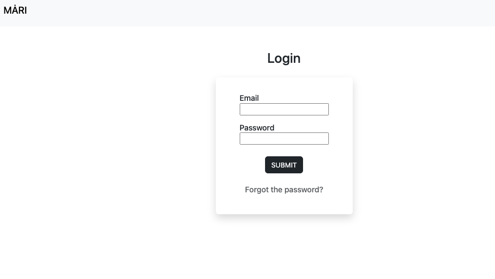
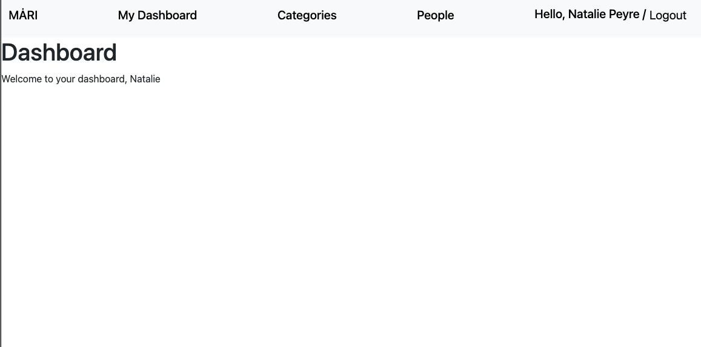

# Change Log

## Version-0.1 | Foundation |  24 July 2026

### Added
- Implemented user authentification - login, password change, logout
- Implemented initial dashboard view
- Initial navigation using Bootstrap navbar

### Security Challenges
- ❗️Experiencing an issue with the login 'user/login' when the user is not logged in .. odd but real (to be fixed)

### Engineering / Database Design / Other notes
- Django project setup
- Django Admin integration

## Version-0.2 | High Level Achievement |  Date

### Added
- ...
- ...

### Challenges
- ...
- ...

### Engineering / Database Design / Security / Other notes
- ...
- ...
